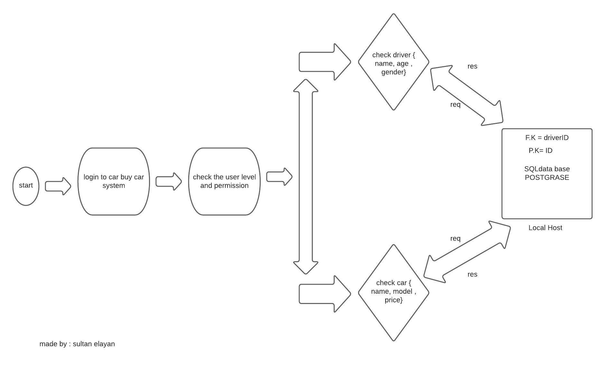

# api-server

## notes 

1. Linked list 
2. Make F.K & P.k and how to connect them to the SQL table 
3. collection part  
4. How to deal with two models and connect them together 

## deployment links

- PR --> https://github.com/sultan-elayan/api-server/pull/1
- repo action --> https://github.com/sultan-elayan/api-server/actions

## MUL

